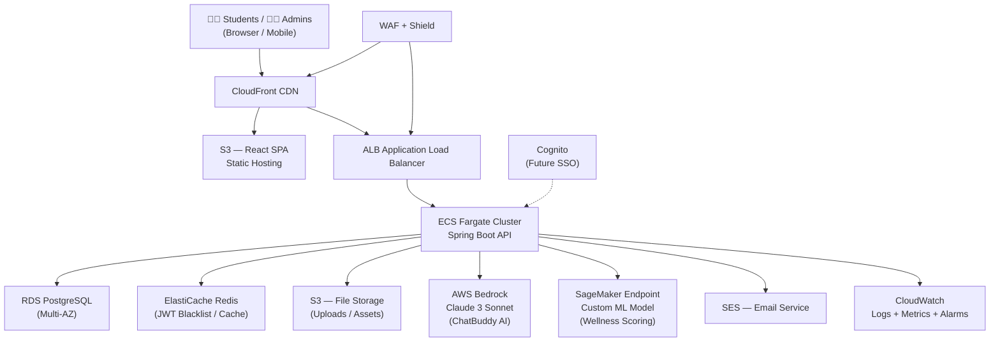
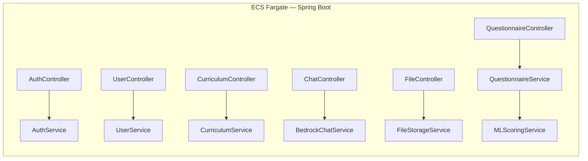
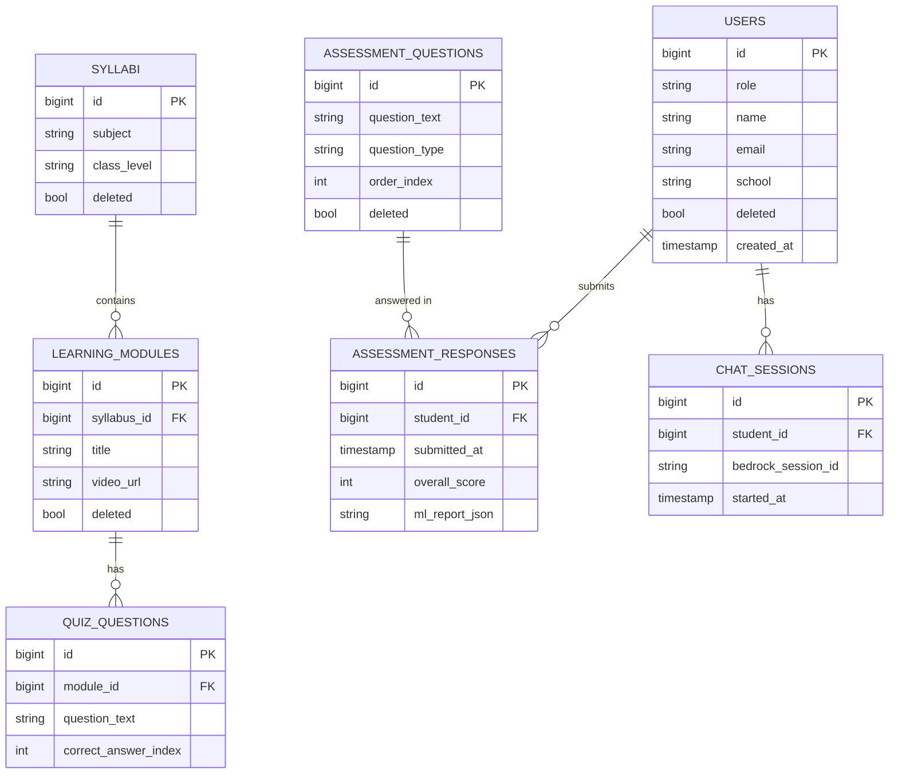
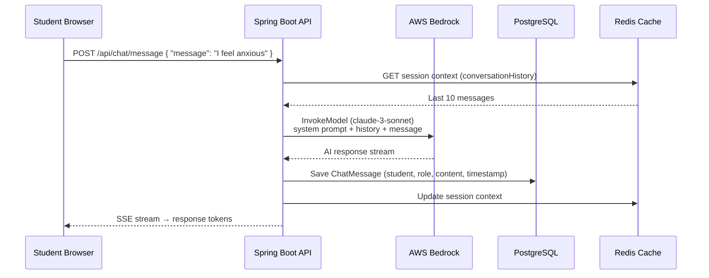
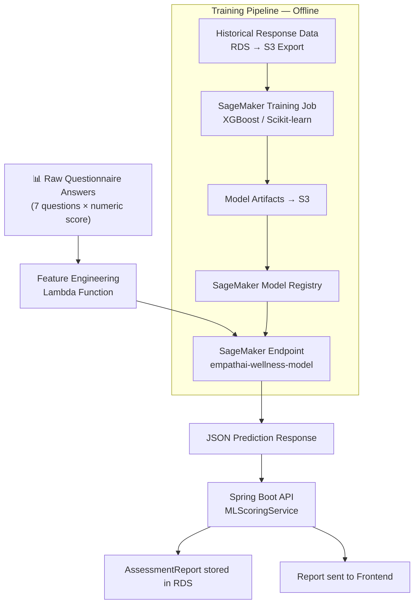
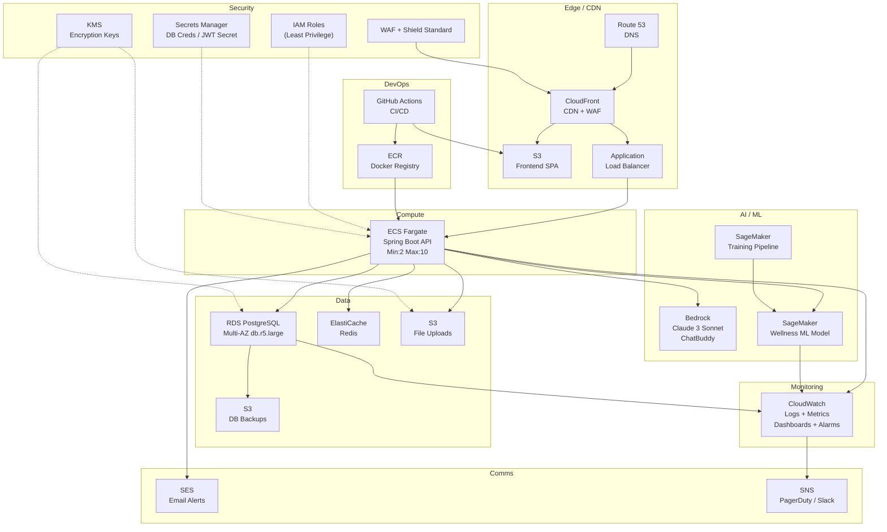
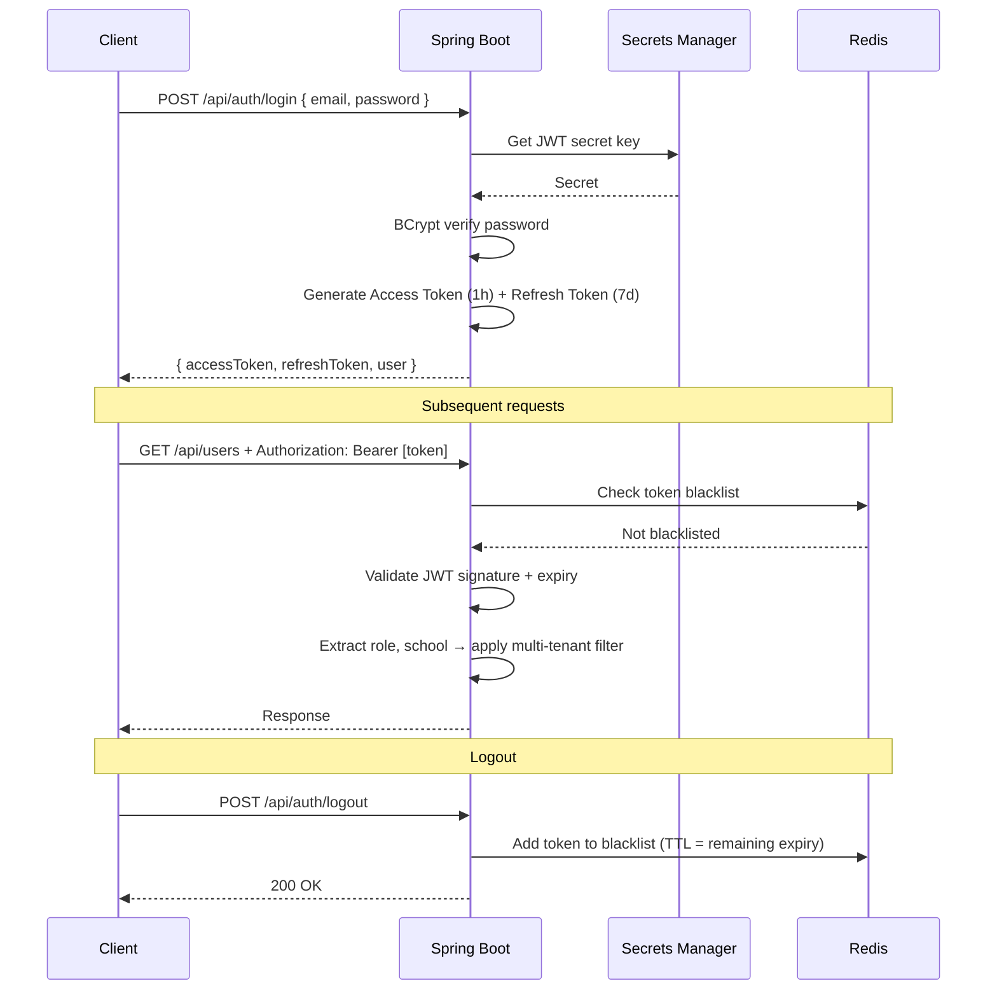
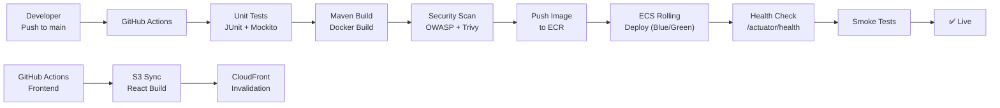
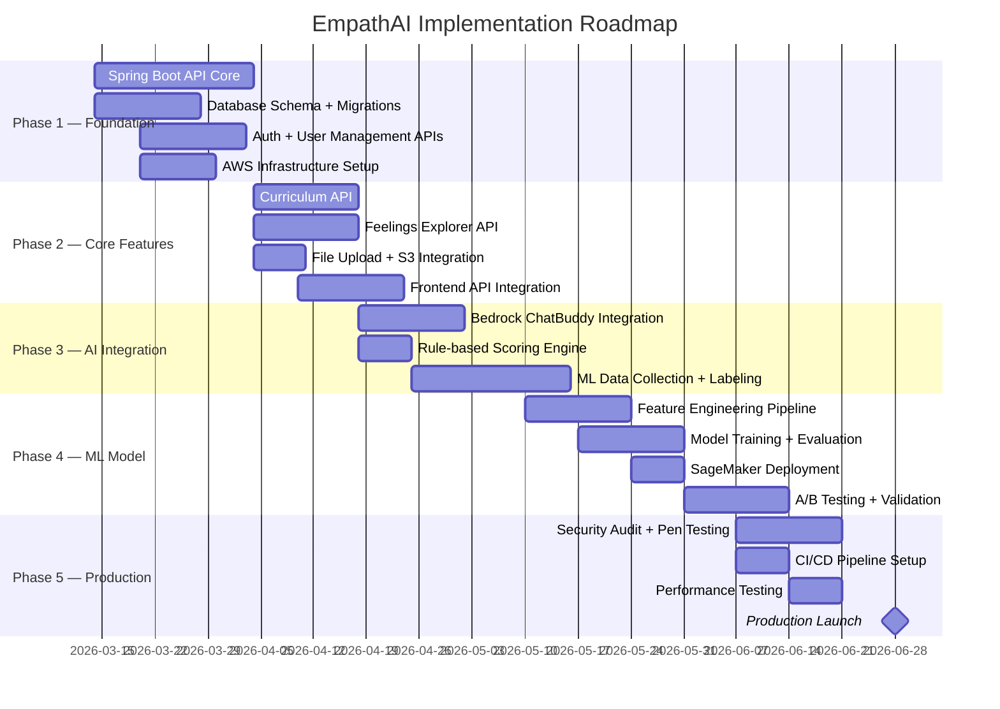

# EmpathAI — Technical Architecture Plan

### Date: March 2026 | Version: 1.0 | Classification: Confidential

---

## Executive Summary

EmpathAI is a cloud-native, AI-powered emotional based learning platform for school students. This document presents the complete technical architecture for a production-grade system hosted on **Amazon Web Services (AWS)**, integrating a **Java Spring Boot REST API**, **React frontend**, **AWS Bedrock-powered AI Chatbot**, and a **custom Machine Learning model** for emotional wellness assessment scoring.

> [!IMPORTANT]
> This architecture is designed for **high availability (99.9% uptime)**, **multi-tenant isolation**, **GDPR/PDPA-compliant data handling**, and **horizontal scalability** from 1,000 to 100,000+ concurrent students.

---

## 1. System Overview



---

## 2. Frontend Layer

| Component | Technology | Hosting |
|---|---|---|
| UI Framework | React 18 + Vite | AWS S3 + CloudFront |
| Styling | TailwindCSS | Bundled in S3 |
| State Management | React Context / Zustand | Client-side |
| HTTP Client | Axios + Interceptors | Client-side |
| CDN / Cache | CloudFront (TTL 86400s) | AWS Edge Locations |
| Custom Domain | Route 53 (DNS) | AWS |
| SSL/TLS | ACM Certificate | Auto-renewed |

**CloudFront Configuration:**
- Compress assets (Brotli/Gzip)
- Cache static assets for 1 year (content-hashed filenames)
- SPA fallback: all routes → [index.html](file:///d:/Freelance_Projects/Empathaii-main/index.html)
- WAF rules: rate limiting, SQL injection, XSS protection

---

## 3. Backend API Layer

### 3.1 Spring Boot REST API



### 3.2 Container Strategy (ECS Fargate)

```
Service:    empathai-api
Image:      ECR → empathai/api:latest
CPU:        512 vCPU (0.5 vCPU)
Memory:     1024 MB
Min Tasks:  2 (High Availability)
Max Tasks:  10 (Auto-scaling)
Port:       8080
Health:     GET /actuator/health
```

**Auto-Scaling Policy:**
- Scale Out: CPU > 70% for 2 minutes → add 2 tasks
- Scale In: CPU < 30% for 10 minutes → remove tasks
- Scheduled: Scale to 4 tasks 8AM–8PM IST on weekdays

### 3.3 API Design Principles

| Principle | Implementation |
|---|---|
| REST + JSON | Spring MVC, Jackson |
| Versioning | `/api/v1/...` prefix |
| Pagination | Spring Data `Pageable` |
| Soft Delete | `@SQLDelete` + `@SQLRestriction` |
| Auditing | JPA `@CreatedDate` / `@LastModifiedDate` |
| Validation | Jakarta `@Valid` annotations |
| Logging | AOP `@Around`, SLF4J, CloudWatch |
| Exception Handling | `@RestControllerAdvice` |

---

## 4. Database Layer

### 4.1 Amazon RDS PostgreSQL

```
Engine:         PostgreSQL 16
Instance:       db.t3.medium → db.r5.large (production)
Multi-AZ:       Yes (automatic failover)
Storage:        100 GB GP3 SSD (auto-scaling to 1TB)
Backup:         Automated daily snapshots (30-day retention)
Encryption:     AWS KMS at rest + TLS in transit
Read Replicas:  1 (for reporting/analytics queries)
```

### 4.2 Entity Relationship Overview



### 4.3 ElastiCache Redis

```
Purpose:
  - JWT token blacklist (logout invalidation)
  - API response caching (syllabi, questions)
  - Rate limiting counters
  - Session metadata

Instance:  cache.t3.micro → cache.r5.large
Mode:      Single-node dev / Cluster mode prod
TTL:       Token blacklist = 7 days | API cache = 300s
```

---

## 5. AI Chatbot — AWS Bedrock

### 5.1 Architecture



### 5.2 AWS Bedrock Configuration

```
Model:      anthropic.claude-3-sonnet-20240229-v1:0
Region:     ap-south-1 (Mumbai) — lowest latency for India
API:        InvokeModelWithResponseStream (streaming SSE)
```

**System Prompt Design:**
```
You are EmpathAI's ChatBuddy — a warm, empathetic AI companion
for school students aged 8–18 in India. Your role is to:
1. Listen actively and validate emotions
2. Offer age-appropriate coping strategies
3. Provide psychoeducation in simple language
4. Escalate to a human counselor if student mentions:
   - Self-harm, suicide, or abuse
   → Respond with crisis resources and flag the conversation

Rules:
- Never diagnose
- Speak in simple, friendly English (or Hindi if requested)
- Keep responses under 150 words
- Use emojis sparingly to feel relatable
```

**Flagged Chat Flow:**
- Keywords detected → `flagged = true` in DB
- Admin panel shows flagged sessions → Psychologist reviews
- School admin notified via SES email

### 5.3 Spring Boot Integration

```java
// BedrockChatService — Key Integration Points
BedrockRuntimeClient bedrockClient = BedrockRuntimeClient.builder()
    .region(Region.AP_SOUTH_1)
    .credentialsProvider(DefaultCredentialsProvider.create())
    .build();

// Streaming response via Server-Sent Events
@GetMapping(value = "/api/chat/stream", produces = MediaType.TEXT_EVENT_STREAM_VALUE)
public SseEmitter streamChat(@RequestParam Long sessionId,
                              @RequestBody ChatRequest req) { ... }
```

**Cost Control:**
- Max tokens per response: 500
- Max messages per session: 50
- Rate limit: 10 messages/minute per student
- Daily token budget alarm on CloudWatch

---

## 6. Custom ML Model — Wellness Score Engine

### 6.1 Problem Statement

After a student completes the **Feelings Explorer** questionnaire (7 questions covering mood, freedom, peer pressure, academic pressure, and memory), the system must:
1. Compute a **multi-dimensional wellness score**
2. Classify the student into a wellness tier
3. Identify **specific risk areas**
4. Generate **personalized intervention recommendations**

### 6.2 ML Pipeline Architecture



### 6.3 Model Design

**Input Features (per questionnaire response):**

| Feature | Description | Type |
|---|---|---|
| `mood_score` | Q1: Overall mood (0–10) | Float |
| `freedom_score` | Q2: Sense of freedom (0–10) | Float |
| `school_pressure` | Q3: School pressure (inverted) | Float |
| `peer_pressure` | Q4: Friend pressure (inverted) | Float |
| `self_pressure` | Q5: Internal pressure (inverted) | Float |
| `home_pressure` | Q6: Home pressure (inverted) | Float |
| `memory_accuracy` | Q7: Memory test (0–4 correct) | Float |
| `class_level` | Grade 1–12 (label encoded) | Int |
| `previous_avg_score` | Rolling avg of last 3 responses | Float |
| `days_since_last` | Gap since last assessment | Int |

**Output:**

```json
{
  "overall_score": 72,
  "wellness_tier": "MODERATE",
  "risk_flags": ["SCHOOL_PRESSURE", "SELF_PRESSURE"],
  "strengths": ["MEMORY", "PEER_RELATIONS"],
  "intervention_probabilities": {
    "BOX_BREATHING": 0.85,
    "FEELINGS_RELEASE": 0.62,
    "CHUNKING_PRACTICE": 0.31,
    "COUNSELOR_REFERRAL": 0.12
  },
  "trend": "DECLINING"
}
```

**Wellness Tiers:**

| Tier | Score | Action |
|---|---|---|
| 🟢 EXCELLENT | 85–100 | Positive reinforcement |
| 🟡 GOOD | 65–84 | Mild suggestions |
| 🟠 MODERATE | 45–64 | Targeted interventions |
| 🔴 NEEDS_SUPPORT | 25–44 | School counselor alert |
| 🚨 CRITICAL | 0–24 | Immediate psychologist referral |

### 6.4 ML Technology Stack

```
Algorithm:      XGBoost (primary) + Logistic Regression (ensemble)
Framework:      scikit-learn 1.4 + XGBoost 2.0
Training:       AWS SageMaker Training Jobs
Serving:        SageMaker Real-time Endpoint (ml.t3.medium)
Retraining:     Weekly automated pipeline (SageMaker Pipelines)
Monitoring:     SageMaker Model Monitor (data drift detection)
Registry:       SageMaker Model Registry (A/B versioning)
```

### 6.5 Data Strategy

**Initial Bootstrapping (Phase 1):**
- Use rule-based heuristics (weighted sum of scores) during data collection
- Label first 500 real responses manually with psychologist review
- Train initial model on labeled data

**Production Learning (Phase 2+):**
- Retrain weekly on accumulated anonymized responses
- Psychologist feedback loop: counselors can correct predictions
- A/B test new model versions on 10% of traffic before full rollout

---

## 7. AWS Infrastructure — Complete Services Map



### 7.1 AWS Services Summary

| Service | Purpose | SKU (Production) |
|---|---|---|
| **Route 53** | DNS + Health Checks | Per query |
| **CloudFront** | CDN, WAF, SSL termination | HTTPS requests |
| **S3** | Frontend SPA + File uploads + Backups | Standard storage |
| **ALB** | Load balancing + health checks | LCU hours |
| **ECS Fargate** | API containers (no EC2 mgmt) | 0.5 vCPU × 2 tasks min |
| **ECR** | Docker image registry | Per GB storage |
| **RDS PostgreSQL** | Primary database | db.r5.large Multi-AZ |
| **ElastiCache Redis** | JWT blacklist + caching | cache.t3.micro |
| **AWS Bedrock** | Claude 3 Sonnet chatbot | Per 1K input/output tokens |
| **SageMaker** | ML model training + hosting | ml.t3.medium endpoint |
| **SES** | Transactional email | Per email sent |
| **CloudWatch** | Logs, metrics, dashboards, alarms | Per GB ingested |
| **SNS** | Alert notifications | Per notification |
| **Secrets Manager** | DB credentials + JWT secret | Per secret/month |
| **KMS** | Encryption key management | Per key/month |
| **WAF** | Web application firewall | Per rule/month |
| **IAM** | Identity & access management | Free |
| **ACM** | SSL/TLS certificates | Free |

---

## 8. Security Architecture

### 8.1 Authentication & Authorization



### 8.2 Multi-Tenancy Security

```
Request → JWT Decoded → Role Check

SUPER_ADMIN   → Sees ALL schools / ALL data
SCHOOL_ADMIN  → Filtered: WHERE school = jwt.school
PSYCHOLOGIST  → Read-only: Student profiles + Assessment responses
CONTENT_ADMIN → Curriculum + Assessment questions (system-wide)
STUDENT       → Own profile + Own responses + Read curriculum
```

### 8.3 Security Controls

| Layer | Control |
|---|---|
| **Network** | VPC with private subnets for RDS + Redis; public only for ALB |
| **Edge** | WAF (OWASP Top 10), Rate limiting (100 req/min/IP) |
| **Transport** | TLS 1.2+ enforced everywhere |
| **Authentication** | JWT + BCrypt (cost 12) |
| **Authorization** | RBAC via Spring `@PreAuthorize` |
| **Data at Rest** | AES-256 via KMS (RDS + S3) |
| **Secrets** | AWS Secrets Manager (no plaintext creds in code) |
| **Logging** | All API calls logged to CloudWatch with user context |
| **Audit** | JPA Auditing: every DB row has `created_at`, `updated_at`, `deleted_at` |
| **File Upload** | Type validation (MIME + extension), max 10MB, UUID filenames |
| **Student Data** | Anonymized for ML training; no PII in model inputs |

---

## 9. CI/CD Pipeline



**Deployment Strategy:**
- **Backend:** ECS Blue/Green deployment (zero downtime)
- **Frontend:** S3 sync + CloudFront cache invalidation
- **Database Migrations:** Flyway (auto-run on startup)
- **Rollback:** ECS previous task definition (< 2 min)

---

## 10. Observability & Monitoring

### 10.1 CloudWatch Dashboard — Key Metrics

| Metric | Source | Alert Threshold |
|---|---|---|
| API Error Rate | ECS logs | > 1% errors → PagerDuty |
| API P99 Latency | ALB | > 2000ms → Slack warning |
| DB CPU | RDS | > 80% → Create Read Replica |
| DB Connections | RDS | > 80% max → Scale API |
| Bedrock Token Cost | CloudWatch Bedrock | > $50/day → Alert |
| ML Endpoint Latency | SageMaker | > 500ms → Alert |
| Failed Logins | Custom metric | > 50/min/IP → WAF block |
| Redis Memory | ElastiCache | > 80% used → Scale |

### 10.2 Logging Strategy

```
Application Logs  → CloudWatch Log Groups
  /empathai/api   → INFO level (all requests)
  /empathai/error → ERROR level (exceptions)
  /empathai/audit → WARN (security events, admin actions)

DB Query Logs     → RDS Enhanced Monitoring
Bedrock API Calls → CloudTrail
SageMaker Calls   → CloudWatch Metrics
```

---

## 11. Cost Estimation (Monthly — Production)

| Service | Estimate (USD/month) |
|---|---|
| ECS Fargate (2 tasks × 0.5vCPU × 1GB) | ~$30 |
| RDS PostgreSQL db.r5.large Multi-AZ | ~$270 |
| ElastiCache cache.t3.micro | ~$25 |
| ALB | ~$20 |
| CloudFront (10GB transfer + requests) | ~$15 |
| S3 (storage + requests) | ~$10 |
| **AWS Bedrock (Claude 3 Sonnet)** | ~$100–500* |
| **SageMaker endpoint (ml.t3.medium)** | ~$50 |
| SageMaker training jobs (weekly) | ~$20 |
| SES (10K emails/month) | ~$1 |
| CloudWatch + logs | ~$20 |
| Route 53 + ACM + Secrets Manager | ~$15 |
| WAF | ~$20 |
| **Total Estimated** | **~$576–$976/month** |

> [!NOTE]
> Bedrock costs scale with usage. At 1,000 active students doing 20 chat messages/day at avg 200 tokens each: ~$120/month. At 10,000 students: ~$1,200/month. Plan for Reserved Instances on RDS after 3 months to save ~40%.

---

## 12. Implementation Roadmap



---

## 13. Team & Resource Requirements

| Role | Responsibility | Count |
|---|---|---|
| **Backend Engineer (Java)** | Spring Boot API, AWS integration | 2 |
| **Frontend Engineer (React)** | API integration, UI polish | 1 |
| **ML Engineer** | SageMaker model development, pipeline | 1 |
| **DevOps / Cloud Engineer** | AWS infra, CI/CD, monitoring | 1 |
| **Clinical Psychologist (Advisor)** | ML label review, prompt engineering, flagged chats | 1 (PT) |

---

## 14. Key Technical Risks & Mitigations

| Risk | Impact | Mitigation |
|---|---|---|
| ML model insufficient training data | High | Start with rule-based scoring; collect 6 months data before ML |
| Bedrock rate limits during peak school hours | Medium | Request quota increase + Redis response caching |
| Student PII data breach | Critical | VPC isolation, KMS encryption, WAF, regular pen tests |
| RDS failover causing downtime | High | Multi-AZ RDS + ECS health checks with ALB retry logic |
| Bedrock cost overrun | Medium | Token limits per session + CloudWatch billing alarms |
| Model drift as student population changes | Medium | Weekly retraining + SageMaker Model Monitor alerts |

---

## 15. Compliance & Data Governance

| Standard | Approach |
|---|---|
| **Student Data Privacy** | No PII in ML training data (anonymized IDs only) |
| **Data Residency** | All AWS services in `ap-south-1` (Mumbai) region |
| **PDPB (India)** | Parental consent flows, data deletion APIs, audit logs |
| **RTO / RPO** | RTO < 1 hour, RPO < 5 minutes (Multi-AZ + automated backups) |
| **Access Logging** | All admin actions logged with user ID + timestamp to CloudWatch |
| **Right to Erasure** | Soft delete + scheduled hard delete job (90-day policy) |

---

## Appendix: API Surface Area

| Domain | Endpoints | Auth Required |
|---|---|---|
| Auth | 4 (login, refresh, logout, me) | Partial |
| Users | 8 (CRUD + schools + reset-password) | Admin |
| Curriculum | 10 (syllabi + modules + quiz) | Mixed |
| Questionnaire | 6 (questions CRUD + submit + report) | Mixed |
| Chat (Bedrock) | 3 (start session, send message, history) | Student |
| Files | 2 (upload, serve) | Mixed |
| **Total** | **~33 endpoints** | — |

> [!TIP]
> **Recommended first milestone for CTO review:** Complete Phase 1 (API core + AWS infrastructure) with a live demo environment on AWS showing login, user management, and a working Bedrock chat interaction. Target: 3 weeks from today.
