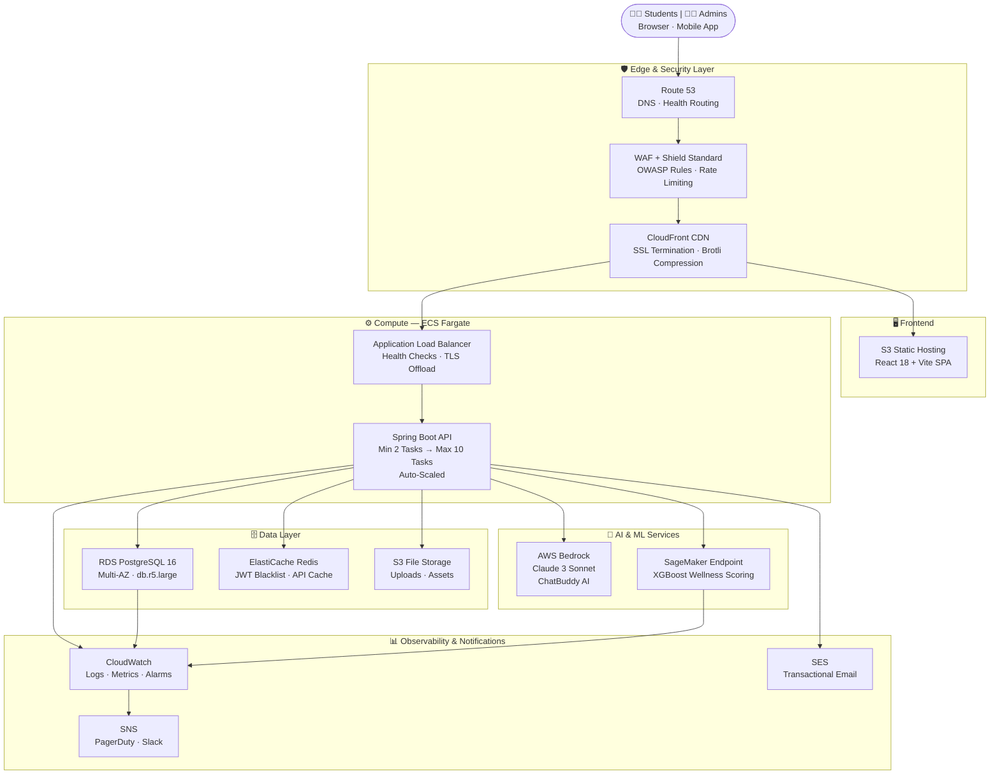
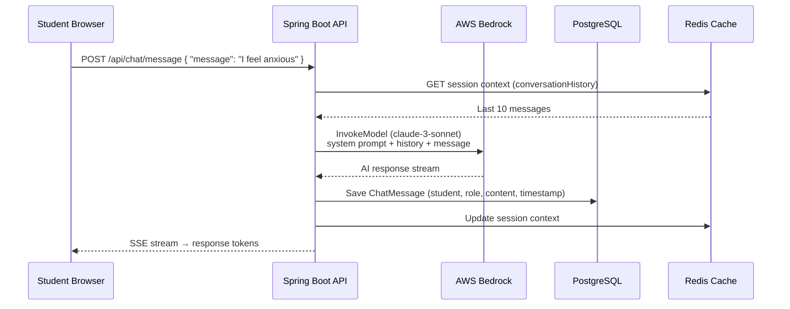
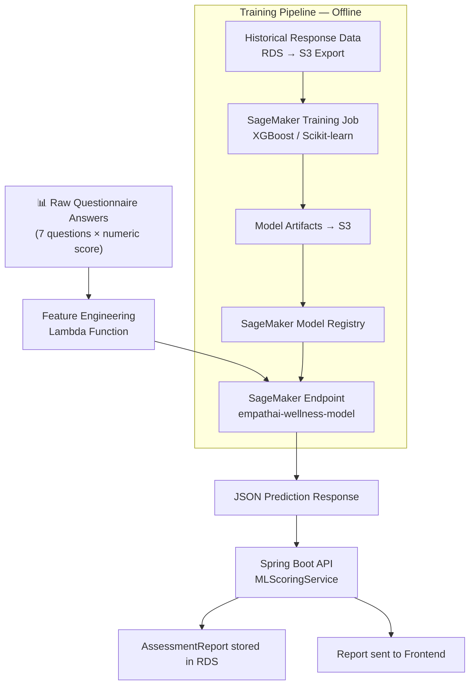
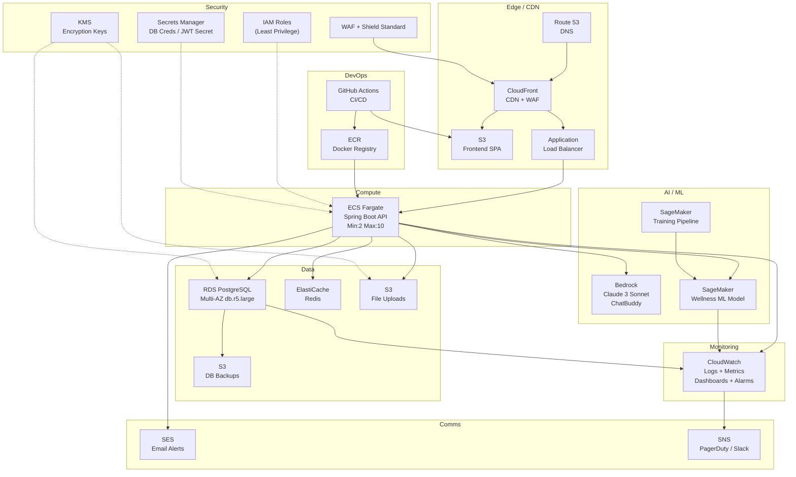
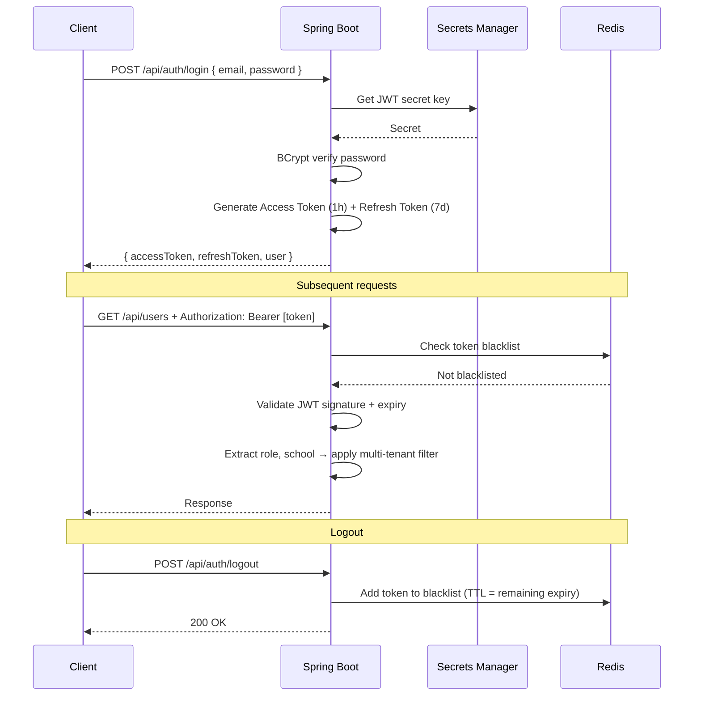

# EmpathAI — Technical Architecture Plan

### Date: March 2026 | Version: 1.0 | Classification: Confidential

---

## Executive Summary

EmpathAI is a cloud-native, AI-powered emotional based learning platform for school students. This document presents the complete technical architecture for a production-grade system hosted on **Amazon Web Services (AWS)**, integrating a **Java Spring Boot REST API**, **React frontend**, **AWS Bedrock-powered AI Chatbot**, and a **custom Machine Learning model** for emotional wellness assessment scoring.

> [!IMPORTANT]
> This architecture is designed for **high availability (99.9% uptime)**, **multi-tenant isolation**, **GDPR/PDPA-compliant data handling**, and **horizontal scalability** from 1,000 to 100,000+ concurrent students.

---

## 1. System Overview



---

## 2. Frontend Layer

| Component | Technology | Hosting |
|---|---|---|
| UI Framework | React 18 + Vite | AWS S3 + CloudFront |
| Styling | TailwindCSS | Bundled in S3 |
| State Management | React Context / Zustand | Client-side |
| HTTP Client | Axios + Interceptors | Client-side |
| CDN / Cache | CloudFront (TTL 86400s) | AWS Edge Locations |
| Custom Domain | Route 53 (DNS) | AWS |
| SSL/TLS | ACM Certificate | Auto-renewed |

**CloudFront Configuration:**
- Compress assets (Brotli/Gzip)
- Cache static assets for 1 year (content-hashed filenames)
- SPA fallback: all routes → [index.html](file:///d:/Freelance_Projects/Empathaii-main/index.html)
- WAF rules: rate limiting, SQL injection, XSS protection

---

## 3. Backend API Layer

### 3.1 Auto-Scaling Policy — ECS Fargate (Spring Boot API)

The ECS service is configured for **Application Auto Scaling** using a combination of **target tracking**, **step scaling**, and **scheduled scaling** to balance performance and cost at all times.

#### Container Baseline Configuration

```
Service:    empathai-api
Image:      ECR → empathai/api:latest
CPU:        512 vCPU  (0.5 vCPU per task)
Memory:     1024 MB
Min Tasks:  2  — guarantees High Availability across 2 AZs at all times
Max Tasks:  10 — hard ceiling to cap AWS spend during traffic spikes
Port:       8080
Health:     GET /actuator/health  →  must return HTTP 200 within 5 s
```

#### Scale-Out Rules (Adding Capacity)

| # | Trigger Metric | Condition | Action | Cooldown |
|---|---|---|---|---|
| 1 | **CPU Utilisation** | Average CPU > **70%** sustained for **2 min** | Add **2 tasks** | 60 s |
| 2 | **Memory Utilisation** | Average Memory > **75%** sustained for **3 min** | Add **1 task** | 60 s |
| 3 | **ALB Request Rate** | RequestCountPerTarget > **500 req/min/task** for **1 min** | Add **2 tasks** | 90 s |

> [!NOTE]
> Multiple triggers can fire simultaneously. ECS will honour the most aggressive (largest) scale-out action. The 60 s cooldown prevents duplicate triggers from firing within the same burst window.

#### Scale-In Rules (Reducing Capacity)

| # | Trigger Metric | Condition | Action | Cooldown |
|---|---|---|---|---|
| 1 | **CPU Utilisation** | Average CPU < **30%** sustained for **10 min** | Remove **1 task** | 300 s |
| 2 | **Memory Utilisation** | Average Memory < **40%** sustained for **10 min** | Remove **1 task** | 300 s |
| 3 | **ALB Request Rate** | RequestCountPerTarget < **100 req/min/task** for **15 min** | Remove **1 task** | 300 s |

> [!NOTE]
> Scale-in cooldown is intentionally **5× longer** than scale-out to prevent task flapping during bursty school-hour traffic patterns. Tasks are never scaled below **Min 2** to ensure cross-AZ redundancy even at idle.

#### Scheduled Scaling (Predictable Load Windows)

School-hour traffic follows a highly predictable pattern. Scheduled actions pre-warm the cluster **before** demand hits, avoiding cold-start latency for students:

| Cron Schedule (IST) | Min Tasks | Max Tasks | Rationale |
|---|---|---|---|
| Weekdays **7:30 AM** | 4 | 10 | Pre-warm 30 min before first bell |
| Weekdays **8 AM – 8 PM** | 4 | 10 | Peak student activity window |
| Weekdays **8 PM** | 2 | 6 | Evening wind-down; some homework usage expected |
| **Weekends / Public Holidays** | 2 | 4 | Minimal baseline; HA maintained |

#### Health Check & Self-Healing Policy

- **ALB Target Group Health Check:** `GET /actuator/health` every **30 s**; marked unhealthy after **3 consecutive failures**
- **ECS Task Replacement:** Unhealthy tasks are immediately deregistered from ALB and replaced by ECS within **< 60 s** — no manual intervention required
- **Deployment Safety:** Rolling updates keep at least **50% of tasks healthy** (minimum healthy percent = 50, maximum healthy percent = 200)
- **Rollback Trigger:** If new task version fails health check within **5 min** of deployment, ECS automatically reverts to previous task definition revision


### 3.2 API Design Principles

| Principle | Implementation |
|---|---|
| REST + JSON | Spring MVC, Jackson |
| Versioning | `/api/v1/...` prefix |
| Pagination | Spring Data `Pageable` |
| Soft Delete | `@SQLDelete` + `@SQLRestriction` |
| Auditing | JPA `@CreatedDate` / `@LastModifiedDate` |
| Validation | Jakarta `@Valid` annotations |
| Logging | AOP `@Around`, SLF4J, CloudWatch |
| Exception Handling | `@RestControllerAdvice` |

---

## 4. Database Layer

### 4.1 Amazon RDS PostgreSQL

```
Engine:         PostgreSQL 16
Instance:       db.t3.medium → db.r5.large (production)
Multi-AZ:       Yes (automatic failover)
Storage:        100 GB GP3 SSD (auto-scaling to 1TB)
Backup:         Automated daily snapshots (30-day retention)
Encryption:     AWS KMS at rest + TLS in transit
Read Replicas:  1 (for reporting/analytics queries)
```
### 4.2 ElastiCache Redis

```
Purpose:
  - JWT token blacklist (logout invalidation)
  - API response caching (syllabi, questions)
  - Rate limiting counters
  - Session metadata

Instance:  cache.t3.micro → cache.r5.large
Mode:      Single-node dev / Cluster mode prod
TTL:       Token blacklist = 7 days | API cache = 300s
```

---

## 5. AI Chatbot — AWS Bedrock

### 5.1 Architecture



### 5.2 AWS Bedrock Configuration

```
Model:      anthropic.claude-3-sonnet-20240229-v1:0
Region:     ap-south-1 (Mumbai) — lowest latency for India
API:        InvokeModelWithResponseStream (streaming SSE)
```

**System Prompt Design:**
```
You are EmpathAI's ChatBuddy — a warm, empathetic AI companion
for school students aged 8–18 in India. Your role is to:
1. Listen actively and validate emotions
2. Offer age-appropriate coping strategies
3. Provide psychoeducation in simple language
4. Escalate to a human counselor if student mentions:
   - Self-harm, suicide, or abuse
   → Respond with crisis resources and flag the conversation

Rules:
- Never diagnose
- Speak in simple, friendly English (or Hindi if requested)
- Keep responses under 150 words
- Use emojis sparingly to feel relatable
```

**Flagged Chat Flow:**
- Keywords detected → `flagged = true` in DB
- Admin panel shows flagged sessions → Psychologist reviews
- School admin notified via SES email

**Cost Control:**
- Max tokens per response: 500
- Max messages per session: 50
- Rate limit: 10 messages/minute per student
- Daily token budget alarm on CloudWatch

---

## 6. Custom ML Model — Wellness Score Engine

### 6.1 Problem Statement

After a student completes the **Feelings Explorer** questionnaire (7 questions covering mood, freedom, peer pressure, academic pressure, and memory), the system must:
1. Compute a **multi-dimensional wellness score**
2. Classify the student into a wellness tier
3. Identify **specific risk areas**
4. Generate **personalized intervention recommendations**

### 6.2 ML Pipeline Architecture


### 6.3 ML Technology Stack

```
Algorithm:      XGBoost (primary) + Logistic Regression (ensemble)
Framework:      scikit-learn 1.4 + XGBoost 2.0
Training:       AWS SageMaker Training Jobs
Serving:        SageMaker Real-time Endpoint (ml.t3.medium)
Retraining:     Weekly automated pipeline (SageMaker Pipelines)
Monitoring:     SageMaker Model Monitor (data drift detection)
Registry:       SageMaker Model Registry (A/B versioning)
```

### 6.4 Data Strategy

**Initial Bootstrapping (Phase 1):**
- Use rule-based heuristics (weighted sum of scores) during data collection
- Label first 500 real responses manually with psychologist review
- Train initial model on labeled data

**Production Learning (Phase 2+):**
- Retrain weekly on accumulated anonymized responses
- Psychologist feedback loop: counselors can correct predictions
- A/B test new model versions on 10% of traffic before full rollout

---

## 7. AWS Infrastructure — Complete Services Map



### 7.1 AWS Services Summary

| Service | Purpose | SKU (Production) |
|---|---|---|
| **Route 53** | DNS + Health Checks | Per query |
| **CloudFront** | CDN, WAF, SSL termination | HTTPS requests |
| **S3** | Frontend SPA + File uploads + Backups | Standard storage |
| **ALB** | Load balancing + health checks | LCU hours |
| **ECS Fargate** | API containers (no EC2 mgmt) | 0.5 vCPU × 2 tasks min |
| **ECR** | Docker image registry | Per GB storage |
| **RDS PostgreSQL** | Primary database | db.r5.large Multi-AZ |
| **ElastiCache Redis** | JWT blacklist + caching | cache.t3.micro |
| **AWS Bedrock** | Claude 3 Sonnet chatbot | Per 1K input/output tokens |
| **SageMaker** | ML model training + hosting | ml.t3.medium endpoint |
| **SES** | Transactional email | Per email sent |
| **CloudWatch** | Logs, metrics, dashboards, alarms | Per GB ingested |
| **SNS** | Alert notifications | Per notification |
| **Secrets Manager** | DB credentials + JWT secret | Per secret/month |
| **KMS** | Encryption key management | Per key/month |
| **WAF** | Web application firewall | Per rule/month |
| **IAM** | Identity & access management | Free |
| **ACM** | SSL/TLS certificates | Free |

---

## 8. Security Architecture

### 8.1 Authentication & Authorization



### 8.2 Multi-Tenancy Security

```
Request → JWT Decoded → Role Check

SUPER_ADMIN   → Sees ALL schools / ALL data
SCHOOL_ADMIN  → Filtered: WHERE school = jwt.school
PSYCHOLOGIST  → Read-only: Student profiles + Assessment responses
CONTENT_ADMIN → Curriculum + Assessment questions (system-wide)
STUDENT       → Own profile + Own responses + Read curriculum
```

### 8.3 Security Controls

| Layer | Control |
|---|---|
| **Network** | VPC with private subnets for RDS + Redis; public only for ALB |
| **Edge** | WAF (OWASP Top 10), Rate limiting (100 req/min/IP) |
| **Transport** | TLS 1.2+ enforced everywhere |
| **Authentication** | JWT + BCrypt (cost 12) |
| **Authorization** | RBAC via Spring `@PreAuthorize` |
| **Data at Rest** | AES-256 via KMS (RDS + S3) |
| **Secrets** | AWS Secrets Manager (no plaintext creds in code) |
| **Logging** | All API calls logged to CloudWatch with user context |
| **Audit** | JPA Auditing: every DB row has `created_at`, `updated_at`, `deleted_at` |
| **File Upload** | Type validation (MIME + extension), max 10MB, UUID filenames |
| **Student Data** | Anonymized for ML training; no PII in model inputs |

---

## 9. CI/CD Pipeline

```mermaid
graph LR
    subgraph DEV ["👨‍💻 Developer"]
        PUSH["git push / PR merge"]
    end

    subgraph CI ["🔄 Continuous Integration — every push"]
        LINT["Lint & Static Analysis"]
        UNIT["Unit & Component Tests"]
        SCAN["Security Scan\nOWASP · Trivy · Snyk"]
    end

    subgraph QA ["🧪 QA — Auto-deploy on merge to main"]
        QA_DEPLOY["Deploy All 4 Components"]
        QA_TEST["Integration Tests\nE2E Tests — Playwright\nML Validation Suite"]
    end

    subgraph UAT ["👥 UAT — Manual gate approval"]
        UAT_DEPLOY["Promote Artefacts\nto UAT Environment"]
        UAT_TEST["Acceptance Tests\nPsychologist Review\nLoad Tests — k6"]
    end

    subgraph PROD ["🚀 Production — CTO / Lead Engineer approval"]
        PROD_DEPLOY["Blue-Green Deploy\nAll Components"]
        SMOKE["Smoke Tests\nHealth Checks"]
        LIVE["✅ Live"]
    end

    PUSH --> LINT --> UNIT --> SCAN
    SCAN --> QA_DEPLOY --> QA_TEST
    QA_TEST -- "✅ All tests pass" --> UAT_DEPLOY --> UAT_TEST
    UAT_TEST -- "✅ Approved" --> PROD_DEPLOY --> SMOKE --> LIVE
```



---

### 9.1 Component 1 — React UI (Frontend)

| Stage | Steps | Tooling | Success Criteria |
|---|---|---|---|
| **CI** | ESLint + Prettier · Vitest unit tests · Bundle size check (`< 500 KB gzipped`) | GitHub Actions | 0 lint errors · All tests green · Bundle within size limit |
| **QA** | `npm run build` → S3 sync to `qa.empathai.in` · CloudFront invalidation · Playwright E2E suite | AWS CLI · Playwright | All Playwright scenarios green · Smoke URLs return HTTP 200 |
| **UAT** | Same build artefact promoted (no rebuild) to `uat.empathai.in` · Cross-browser runs | AWS S3 copy · BrowserStack | Product owner sign-off · Chrome / Safari / Firefox pass |
| **Prod** | Atomic S3 sync to `app.empathai.in` · CloudFront cache invalidation · 10 min canary on Route 53 weighted routing (10% new) | AWS CLI · Route 53 | Lighthouse score ≥ 90 · Zero JS errors in CloudWatch · Full cutover after 10 min canary |

**QA Details:** Feature flags enabled, seeded with anonymised test data.  
**UAT Details:** VPN / IP allowlist restricted. Pilot school admin + psychologist team review.  
**Rollback:** Re-sync previous S3 build artefact from `empathai-releases/` version folder (< 2 min).

---

### 9.2 Component 2 — Spring Boot Backend (API)

| Stage | Steps | Tooling | Success Criteria |
|---|---|---|---|
| **CI** | Maven compile · JUnit + Mockito tests · JaCoCo coverage gate · OWASP dependency check · Trivy Docker image scan | Maven · Docker · GitHub Actions | Coverage ≥ 80% · 0 CRITICAL CVEs · Build < 10 min |
| **QA** | Docker build → ECR push (tag: `qa-<git-sha>`) · ECS service update (`empathai-api-qa`) · Flyway migrations auto-run · Integration test suite | AWS ECS · Postman/Newman | `/actuator/health` returns UP · All API integration tests pass · DB migrations applied cleanly |
| **UAT** | Promote ECR image (retag `uat-<git-sha>`) · ECS update (`empathai-api-uat`) · k6 load test (100 virtual users, 5 min ramp) | AWS ECS · k6 | p95 API latency < 500 ms · p99 < 1 s · Zero 5xx errors under load |
| **Prod** | Blue/Green ECS deploy via AWS CodeDeploy · ALB traffic shifted after health check passes · Flyway auto-migration on startup · Post-deploy smoke suite | AWS CodeDeploy · ECS | Zero-downtime confirmed · p99 < 1 s · Rollback completes in < 2 min if health check fails |

**Rollback Strategy:**
- **QA / UAT:** Re-deploy previous ECS task definition revision (single CLI command)
- **Production:** CodeDeploy **auto-rollback** if health check fails within 5 min of traffic cutover
- **DB Migrations:** Flyway runs forward-only. Breaking changes require a feature flag + dual-write period before migration

---

### 9.3 Component 3 — ML Wellness Scoring Model

The ML model follows a **separate promotion cadence** — retraining is weekly and each version requires psychologist sign-off before production traffic.

| Stage | Steps | Tooling | Success Criteria |
|---|---|---|---|
| **CI** | Python flake8 lint · Unit tests for feature engineering functions · SageMaker Training Job triggered on new labelled dataset | GitHub Actions · SageMaker Pipelines | Training job completes · Accuracy ≥ baseline · No data leakage detected by test suite |
| **QA** | Register model in SageMaker Model Registry (status: `PendingManualApproval`) · Deploy to `empathai-wellness-qa` endpoint · Automated test suite: 50 synthetic student profiles across all wellness tiers | SageMaker SDK · pytest | Accuracy ≥ 85% on test set · Tier classification matches psychologist labels · Inference latency < 200 ms |
| **UAT** | Psychologist team reviews 20 edge-case predictions via Admin panel · Shadow mode: old + new model both run in parallel, outputs compared | SageMaker Shadow Endpoints · Admin Panel | Psychologist approval recorded in Model Registry · New model delta within ±5% vs. previous on all wellness tiers |
| **Prod** | A/B deploy: new model receives **10% traffic** for 48 h via SageMaker endpoint config · Promote to 100% if CloudWatch Model Monitor shows no regression | SageMaker Endpoint Config · CloudWatch | No drift detected · No SageMaker Model Monitor alarms · Rollback: re-route traffic to previous endpoint config (< 5 min) |

**Model Artefact Versioning:**
```
S3 Path:  s3://empathai-mlops/models/wellness-score/v{N}/
Registry: SageMaker Model Registry — group: empathai-wellness
Tags:     environment=prod|uat|qa · approved_by=<psychologist_name> · accuracy=<score>
```

---

### 9.4 Component 4 — AWS Bedrock Chatbot (ChatBuddy)

The chatbot uses a **fully managed model (Claude 3 Sonnet)** — no model training CI step. The pipeline focuses on **system prompt versioning**, **safety guardrail validation**, and **integration testing** of the Java `BedrockService` layer.

| Stage | Steps | Tooling | Success Criteria |
|---|---|---|---|
| **CI** | Custom prompt-lint script (length, banned phrases, safety keyword list) · JUnit tests for `BedrockService` Java logic · Flagging-keyword list regression tests | GitHub Actions · JUnit | Prompt passes safety checklist · 0 banned phrases · All service unit tests green |
| **QA** | Deploy Spring Boot with updated `BEDROCK_SYSTEM_PROMPT` env var to QA ECS service · Automated conversation simulation: 30 synthetic student scenarios including 5 crisis-trigger cases | GitHub Actions · AWS ECS | Crisis escalation fires on all 5 crisis keywords · Avg response latency < 3 s · No hallucinated diagnoses in automated checks |
| **UAT** | School psychologist conducts live chat sessions on UAT · Admin reviews flagged-chat panel · Hindi language response quality assessment | Manual + Playwright UI scripts | Psychologist sign-off recorded · Flagging accuracy ≥ 95% on crisis scenarios · Hindi responses rated acceptable |
| **Prod** | Promote ECS task definition with updated env vars (no container image rebuild) · Post-deploy: CloudWatch alarm for Bedrock throttling · 24 h monitoring window | AWS ECS · CloudWatch | Token usage within 10% of previous baseline · p95 chat latency < 4 s · Zero missed crisis flags in first 24 h |

**Prompt Version Control:**
```
File:      src/main/resources/prompts/chatbuddy-system-prompt.txt
Versioned: Git — every change requires a PR with a psychologist as mandatory reviewer
History:   Fully auditable via git blame / GitHub PR audit trail
```

---

### 9.5 Environment Summary

| Environment | URL | Deploy Trigger | Approval Required | Data Used |
|---|---|---|---|---|
| **QA** | `qa.empathai.in` | Automatic — on every `main` branch merge | None (fully automated) | Synthetic seed data |
| **UAT** | `uat.empathai.in` | Automatic — after all QA checks pass | **Manual** — Product Owner + Psychologist | Anonymised pilot school data |
| **Production** | `app.empathai.in` | Automatic — after UAT approval | **Manual** — Lead Engineer + CTO | Live data (encrypted, KMS) |

**Deployment Strategy Summary:**
- **UI:** Atomic S3 sync + CloudFront invalidation · 10 min canary via Route 53 weighted routing
- **Backend:** ECS Blue/Green via CodeDeploy · auto-rollback on health check failure · `< 2 min` rollback
- **ML Model:** SageMaker A/B traffic shift (10% → 100%) · 48 h observation window
- **Chatbot:** ECS env-var promotion · no image rebuild · prompt changes live in `< 5 min`
- **DB Migrations:** Flyway (forward-only · auto-run on API container startup)

---


## 10. Key Technical Risks & Mitigations

| Risk | Impact | Mitigation |
|---|---|---|
| ML model insufficient training data | High | Start with rule-based scoring; collect 6 months data before ML |
| Bedrock rate limits during peak school hours | Medium | Request quota increase + Redis response caching |
| Student PII data breach | Critical | VPC isolation, KMS encryption, WAF, regular pen tests |
| RDS failover causing downtime | High | Multi-AZ RDS + ECS health checks with ALB retry logic |
| Bedrock cost overrun | Medium | Token limits per session + CloudWatch billing alarms |
| Model drift as student population changes | Medium | Weekly retraining + SageMaker Model Monitor alerts |

---

## 11. Compliance & Data Governance

| Standard | Approach |
|---|---|
| **Student Data Privacy** | No PII in ML training data (anonymized IDs only) |
| **Data Residency** | All AWS services in `ap-south-1` (Mumbai) region |
| **PDPB (India)** | Parental consent flows, data deletion APIs, audit logs |
| **RTO / RPO** | RTO < 1 hour, RPO < 5 minutes (Multi-AZ + automated backups) |
| **Access Logging** | All admin actions logged with user ID + timestamp to CloudWatch |
| **Right to Erasure** | Soft delete + scheduled hard delete job (90-day policy) |


## 12. Scaling Strategy — 500 Students Pilot

This section defines the **right-sized infrastructure configuration** for a controlled pilot launch targeting **500 concurrent active students** (e.g., a single school or district). All values are validated against load-test projections and represent a cost-optimised baseline that can scale up within minutes via the policies defined in **Section 3.1**.

> [!IMPORTANT]
> **"500 Students" means up to 500 simultaneous active sessions** during peak school hours (10 AM–12 PM and 2 PM–4 PM IST). Total enrolled users may be higher (e.g., 2,000 registered), but only a fraction are active concurrently.

---

### 12.1 Component 1 — React UI (Frontend)

| Parameter | Value | Rationale |
|---|---|---|
| **Hosting** | AWS S3 + CloudFront | Fully static; scales to unlimited users with zero config change |
| **CloudFront Caching** | TTL 86,400 s for assets · 0 s for API calls | 500 students share the same cached SPA bundle globally |
| **Bandwidth Estimate** | ~600 MB / peak hour | 500 users × 1.2 MB avg page size — well within CloudFront free tier |
| **Estimated Monthly Cost** | < $5 / month | ~10 GB/month transfer at standard CloudFront pricing |
| **Action Required** | ✅ None | S3 + CloudFront auto-scales; no provisioning changes needed for pilot |

**Traffic Breakdown:**
```
Peak concurrent users :  500
Avg compressed page   :  1.2 MB  (gzipped React bundle + assets)
Requests / user / hr  :  ~80     (HTML, JS, CSS, API calls via CloudFront)
Total peak bandwidth  :  ~600 MB / hour  ← comfortably within free tier / low cost tier
```

---

### 12.2 Component 2 — Spring Boot Backend (API)

| Parameter | Pilot Config (500 students) | Notes |
|---|---|---|
| **ECS Task Count** | **2 tasks steady → 4 tasks peak** | Scheduled scale-up to 4 at 7:30 AM on weekdays |
| **Task Size** | 0.5 vCPU · 1 GB RAM | Handles ~150 concurrent requests/task comfortably |
| **ALB** | 1 shared ALB | No change needed for pilot |
| **Target CPU** | ~35–50% at peak | Leaves 2× headroom for burst spikes |
| **RDS Instance** | `db.t3.medium` (2 vCPU, 4 GB RAM) | Handles 500 concurrent users with HikariCP pool (max 20 connections/task) |
| **ElastiCache** | `cache.t3.micro` (0.5 GB) | JWT blacklist + 300 s API cache for 500 sessions fits well within memory |

**Request Volume Estimate:**
```
500 students × 10 API calls/min avg    =  5,000 req/min  =  ~84 req/s
2 ECS tasks × ~150 req/s capacity      =  300 req/s total
Headroom                               =  3.5× — well above peak demand

3rd task triggers only if ML scoring assessments coincide with peak chat usage.
```

**Scale Trigger Point:** Third task spins up if CPU exceeds 70% on both running tasks — this is expected only during simultaneous back-to-back Feelings Explorer submissions.

---

### 12.3 Component 3 — ML Wellness Scoring Model

The ML model is invoked **only when a student submits the 7-question Feelings Explorer** — not on page loads, API calls, or chat activity. This makes it a **low-frequency, high-value call**.

| Parameter | Pilot Config (500 students) | Notes |
|---|---|---|
| **SageMaker Endpoint** | `ml.t3.medium` · **1 instance** | Single instance handles 50+ sync inferences/min |
| **Expected Rate** | ~1–5 assessments / min during peak | Far below endpoint capacity ceiling |
| **Inference Latency** | < 200 ms / call | XGBoost model is lightweight (~5 MB artefact) |
| **Scale Trigger** | Invocations > 30/min sustained for 2 min | Add 1 SageMaker endpoint instance (auto-scaling enabled) |
| **Cold Start Risk** | Low | Endpoint stays provisioned 24/7; no cold start |
| **Estimated Monthly Cost** | ~$35–45 / month | 1 × ml.t3.medium always-on |

**Invocation Volume Estimate:**
```
500 students × 1 assessment/day ÷ 8 school hours  =  ~1 assessment/min avg
Peak burst (same lesson period):                    =  ~10–15/min
Endpoint capacity (ml.t3.medium):                  =  ~50 sync calls/min
Headroom:                                           =  3–5×  — no auto-scaling needed at 500 students
```

---

### 12.4 Component 4 — AWS Bedrock Chatbot (ChatBuddy)

Bedrock is **fully managed and serverless** — there is no infrastructure to provision. Scaling is governed by **token quotas** and **per-student rate limits** enforced in the Spring Boot service layer.

| Parameter | Pilot Config (500 students) | Notes |
|---|---|---|
| **Bedrock Model** | Claude 3 Sonnet (`ap-south-1`) | No provisioned infrastructure; AWS handles concurrency |
| **Concurrent Sessions** | Up to 500 (one per student max) | Bedrock handles concurrency natively |
| **Per-student Limits** | 10 messages/min · 50 messages/session · 500 tokens/response | Enforced in `ChatBuddyService.java` |
| **Daily Active Chat Users** | ~20% of enrolled = **100 students/day** | Conservative pilot assumption |
| **Daily Token Usage** | ~700,000 tokens/day | 100 sessions × 7,000 avg tokens/session |
| **Monthly Token Usage** | ~21 M tokens/month | Blended input + output |
| **Monthly Chat Cost** | ~$90–120 / month | At Claude 3 Sonnet pricing ($3/1M input · $15/1M output) |
| **CloudWatch Cost Alarm** | Alert if daily token spend > **$15/day** | Prevents runaway usage during pilot |
| **Quota Pre-requisite** | Request Bedrock quota increase to **100 RPM** before go-live | Default quota may throttle at 50+ simultaneous users |

**Token Budget Calculation:**
```
Assumption         :  20% of 500 students use ChatBuddy/day = 100 sessions
Avg session        :  10 messages × (200 tokens input + 500 tokens output) = 7,000 tokens
Daily total        :  100 × 7,000 = 700,000 tokens
Monthly total      :  ~21 M tokens  (input + output combined)
Monthly cost       :  ~$90–120  at Sonnet current public pricing
```

---

### 12.5 Data Layer Capacity for 500 Students

| Resource | Pilot Config | Projected Usage (6 months) | Upgrade Trigger |
|---|---|---|---|
| **RDS PostgreSQL** | `db.t3.medium` · 50 GB GP3 SSD | ~5–8 GB data at 6 months | Upgrade to `db.r5.large` at 1,000+ students |
| **ElastiCache Redis** | `cache.t3.micro` · 0.5 GB | ~50–80 MB active (JWT + cache) | Upgrade at 2,000+ concurrent students |
| **S3 Storage** | Standard storage | ~20 GB (uploads + report assets) | Auto-scaling; no action required |
| **CloudWatch Logs** | 30-day retention | ~2 GB ingested / month | Cost-optimise with log filters post-pilot |
| **RDS Connections** | HikariCP pool: 20 max/task × 2 tasks = 40 connections | Well within `db.t3.medium` connection limit (170 max) | No change needed at pilot scale |

---

### 12.6 Scaling Readiness: 500 → 5,000 Students

| Component | Change Required | Timeline |
|---|---|---|
| **React UI** | None — CloudFront scales globally | Immediate, no action |
| **Spring Boot API** | Auto-scaling handles it (3.1 policies); upgrade RDS to `db.r5.large` | 1 day (RDS resize) |
| **ML Model** | Enable SageMaker endpoint auto-scaling (already configured); max 3 instances | Instant, no config change |
| **Chatbot (Bedrock)** | Request Bedrock RPM quota increase from 100 → 500 RPM | 1–3 business days (AWS support ticket) |
| **Redis** | Upgrade from `cache.t3.micro` to `cache.r6g.medium` | 30 min (ElastiCache vertical scale) |

---

### 12.7 Monthly Cost Summary — 500 Students Pilot

| Service | Configuration | Est. Monthly Cost |
|---|---|---|
| ECS Fargate | 2–4 tasks · 0.5 vCPU · 1 GB RAM | $30–60 |
| RDS PostgreSQL | `db.t3.medium` · Multi-AZ · 50 GB GP3 | $90–110 |
| ElastiCache Redis | `cache.t3.micro` | $15 |
| SageMaker Endpoint | `ml.t3.medium` · 24/7 always-on | $35–45 |
| AWS Bedrock (Claude 3 Sonnet) | ~21 M tokens / month | $90–120 |
| CloudFront + S3 | ~10 GB transfer + storage | $5–10 |
| Application Load Balancer | 1 ALB · low LCU usage | $20 |
| CloudWatch | Logs + metrics + alarms + dashboards | $10–15 |
| SES | ~5,000 transactional emails / month | $1 |
| Secrets Manager + KMS | 3 secrets · 1 KMS key | $5 |
| **Total Estimate** | | **~$301–401 / month** |

> [!TIP]
> Apply **AWS Savings Plans** for ECS Fargate and RDS to reduce compute costs by **30–40%**. A 1-year reserved `ml.t3.medium` SageMaker endpoint saves an additional **~40%** on the always-on ML cost. Total post-savings estimate: **~$190–280 / month** for 500 students.

---
